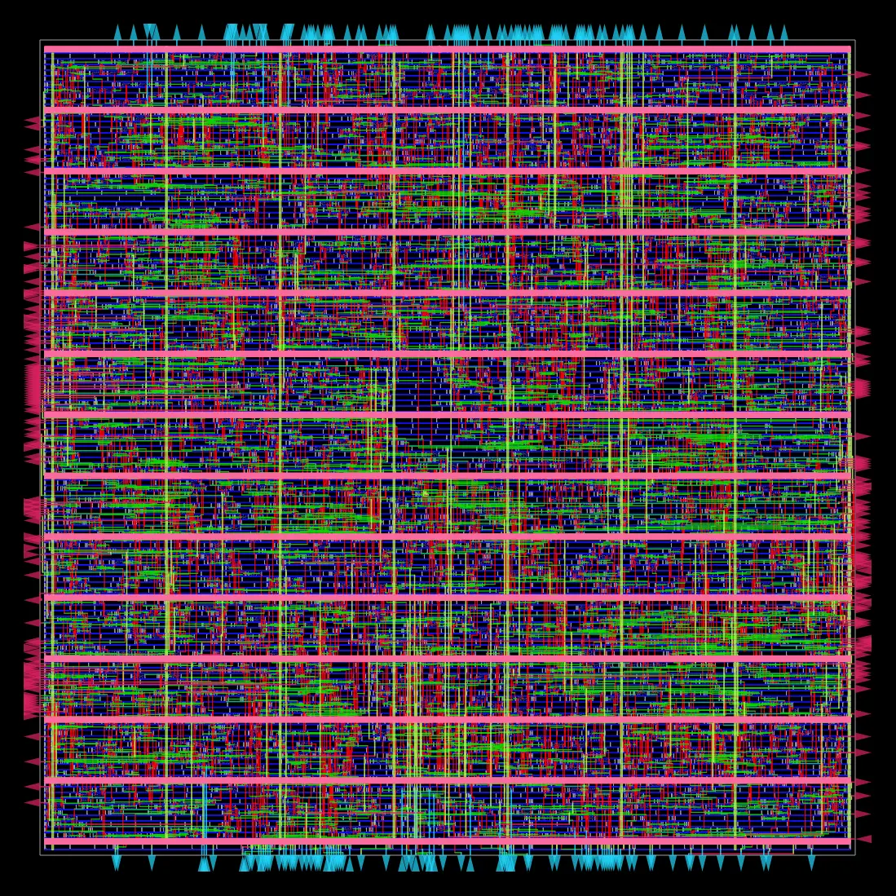
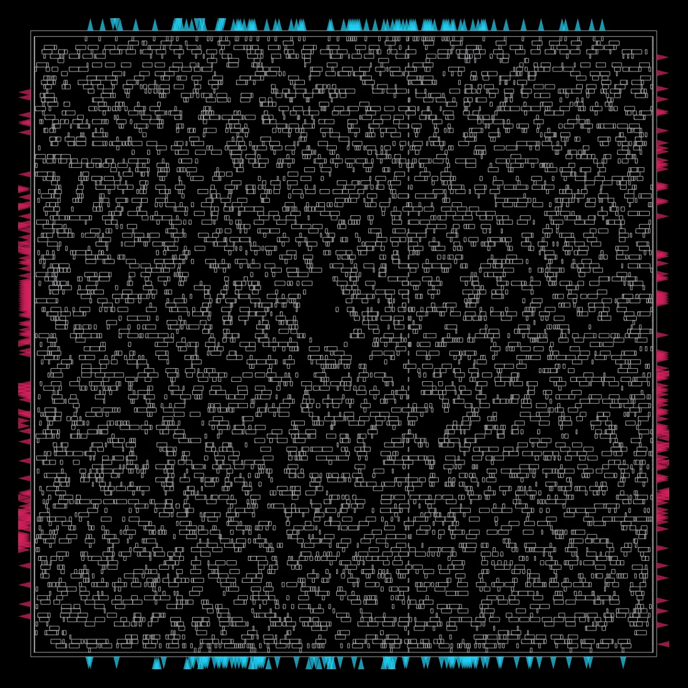

# 4x4 Systolic MAC Array: RTL to GDSII with OpenROAD

A parameterized 4x4 systolic array of multiply-accumulate (MAC) units, written in Verilog, verified with a self-checking testbench, and taken through a complete RTL-to-GDSII flow with OpenROAD-flow-scripts on the Nangate45 open-source library. The project measures how clock speed and operand bit width (INT8 vs INT4) change area, timing and power.

## Why this design

A MAC (`acc = acc + a * b`) is the core operation of neural-network inference. A systolic array arranges many MACs in a grid so data flows between neighbours, which keeps wiring short and the structure regular. This is the basic building block of AI accelerators.

## Design

| File | Purpose |
|---|---|
| `rtl/int8/mac.v` | Single MAC unit (warm-up block) |
| `rtl/int8/pe.v` | Processing element: multiplies, accumulates, passes data right and down |
| `rtl/int8/systolic.v` | Parameterized N x N array built with `generate` loops (default N=4, W=8, ACC_W=20) |
| `rtl/int4/` | Same RTL with W=4, ACC_W=12 |
| `tb/` | Self-checking testbenches (compare all 16 outputs against a plain matrix multiply) |
| `flow/` | ORFS `config.mk` and `constraint.sdc` for each variant |

Inputs are fed with a staggered (skewed) schedule so the correct operands meet at each PE.

## Verification

- `tb_mac.v`: three directed accumulations, including a negative operand.
- `tb_systolic.v` (INT8) and `tb_systolic_int4.v` (INT4): 4x4 matrix multiply checked element by element. Both print `PASS: all 16 results match`.

Run with Icarus Verilog:

```bash
iverilog -g2012 -o sim rtl/int8/pe.v rtl/int8/systolic.v tb/tb_systolic.v && vvp sim
```

## Physical design flow

- Tool: OpenROAD-flow-scripts (Yosys synthesis, OpenROAD floorplan, placement, CTS, global and detailed routing)
- Platform: Nangate45
- Core utilization: 30%, placement density add-on 0.20
- Result: DRC-clean routed layout and `6_final.gds` for every run shown below

## Results

### Clock sweep (INT8, 4x4)

| Clock | Frequency | Area (um^2) | Setup slack | Power |
|---|---|---|---|---|
| 5.0 ns | 200 MHz | 12,109 | +2.41 ns | 4.05 mW |
| 3.0 ns | 333 MHz | 12,104 | +0.80 ns | 6.58 mW |
| 2.5 ns | 400 MHz | 12,102 | +0.40 ns | 7.84 mW |
| 2.0 ns | 500 MHz | 12,268 | +0.15 ns | 9.97 mW |
| 1.8 ns | 555 MHz | 12,477 | 0.00 ns | 11.3 mW |
| 1.5 ns | 667 MHz | 13,112 | -0.21 ns (fails) | 13.9 mW |

### Bit width (4x4, 3 ns clock)

| | INT8 | INT4 | Change |
|---|---|---|---|
| Area | 12,104 um^2 | 4,344 um^2 | 2.8x smaller |
| Power | 6.58 mW | 2.27 mW | 2.9x lower |
| Setup slack | +0.80 ns | +1.28 ns | 0.48 ns more margin |

## Observations

- **Maximum clock is about 1.8 ns (~555 MHz)** for the INT8 array on this library. At 1.5 ns timing fails even after the optimizer upsizes gates.
- **Area is flat until timing gets tight.** From 5 ns down to 2.5 ns area is constant; below that the tool trades area for speed (+3% at 1.8 ns, +8% at 1.5 ns).
- **Dynamic power scales with frequency.** Energy per clock tick stays near 20 pJ across the sweep, and leakage is only ~2-6% of total power.
- **Halving the bit width cuts area and power by about 2.8-2.9x**, consistent with multiplier area growing roughly with the square of operand width.

## Limitations

- Nangate45 is an academic, typical-condition library. Absolute numbers are not comparable to a commercial process.
- Power uses the flow's default switching-activity assumption, so compare runs against each other rather than treating the values as absolute.
- The INT8 accumulator is 20 bits, 2 bits wider than the 18 strictly needed for a 4-term sum, which slightly inflates the INT8 cost.
- Verification uses one directed matrix pair, not randomized or corner-case stimulus.

## Reproduce

```bash
# in ~/OpenROAD-flow-scripts/flow
cp -r <repo>/flow/int8/* designs/nangate45/mac_array/      # also place RTL in designs/src/mac_array/
make DESIGN_CONFIG=./designs/nangate45/mac_array/config.mk
```

Edit `set clk_period` in `constraint.sdc` to sweep the clock, and use `FLOW_VARIANT=<name>` to keep runs separate.

## Layout




## Possible next steps

- Randomized self-checking testbench
- Array-size sweep (N = 2, 4, 8)
- Utilization and CTS parameter sweeps
- Pipelined multiplier to push the clock beyond 555 MHz
